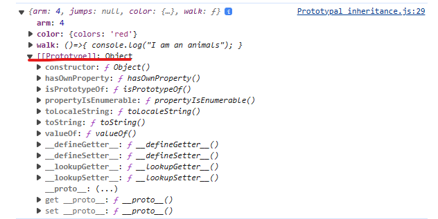
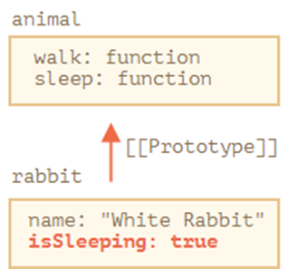
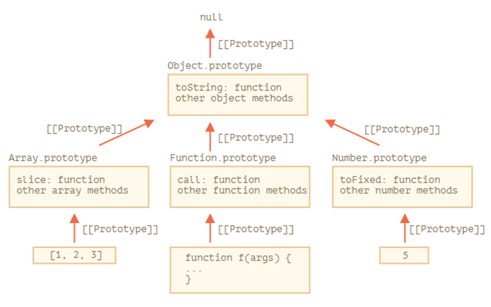
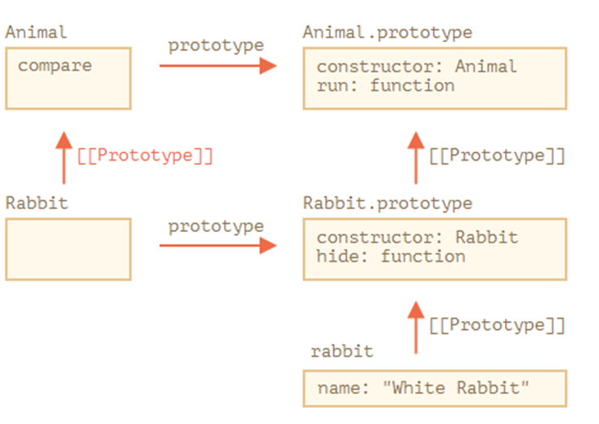

**[Javascript Core]([https://](https://javascript.info/))**
# OOP trong JavaScript
**1. Property flags and descriptors Object**
   - Quy định các flags đi kèm với các thuộc tính quy định việc đọc ghi xóa sửa
     - writable – if true, the value can be changed, otherwise it’s read-only.( false: không cho phép ghi đè chỉ cho phép đọc)
       - Định nghĩa thuộc tính chỉ đọc (read-only):
            ```javascript
            let person = {
                name: 'John'
            };

            Object.defineProperty(person, 'age', {
            value: 30,
            writable: false, // Không thể gán lại giá trị cho 'age'
            enumerable: true, // Sẽ được liệt kê khi dùng vòng lặp for...in hoặc Object.keys
            configurable: false // Không thể xóa hoặc định nghĩa lại thuộc tính này
            });

            let arr = [1, 2, 3];

            Object.defineProperty(arr, 'length', {
            writable: false
            });

            arr.push(4); // Lỗi! Không thể thay đổi độ dài mảng
            ```
     - enumerable – if true, then listed in loops, otherwise not listed.(false:bỏ qua trong vòng lặp)
       - ```javascript
            for(let i of cat.child)
            {
                console.log(i)
            }
            Object.defineProperty(cat,"child",{
                enumerable:false
            })
            console.log(Object.getOwnPropertyDescriptor(cat, "child"))
            for(let i in cat)
            {
                console.log(i)
            }
         ```
     - configurable – if true, the property can be deleted and these attributes can be modified, otherwise not.(false: không thể xóa)
       - ```javascript
         Object.defineProperty(cat, "name", {
           configurable: false,
         });
         delete cat.name;
         console.log(cat); // Không thể xóa
         let person = {
            name: 'John',
            age: 30
            };
            Object.defineProperty(person, 'age', {
                configurable: false // Không thể xóa hoặc định nghĩa lại thuộc tính 'age'
            });
         ```
   - Cú pháp viết gộp:
        ```js
       let cat = {};
       Object.defineProperties(cat, {
         name: { writable: false },
         animals: { value: 4, writable: false },
       });
       cat.name = "doggg";
       console.log(cat);
       ```
**2. Property getters and setters, Access modifier  Object**
- Getter and setter 
    ```javascript
            const myCar={
                color:"blue",
                make:"Toyata",
                getColor:function(){
                    return this.color;
                },
                setColor:function(newColor){
                    this.color=newColor;
                },
                get color(){
                    return this.dcolor
                },
                set color(newColor){
                    this.dcolor=newColor;
                }
            }
            console.log('color',myCar.color);
            const a= myCar.getColor();
            console.log('color', a);
    ```
- Getter and setter with defineProperty
    ```javascript
    const myCat={
        dcolor:"blue",
        dmake:"Sang",
    }
    Object.defineProperty(myCat, "color", {
        get:function(){
            return this.dcolor
        },
        set : function(newColor){
            this.dcolor=newColor;
        }
    })
    console.log(Object.getOwnPropertyDescriptor(myCat, "color"));
    console.log(myCat.color);

    myCat.color = 'yellow';
    console.log('color:', myCat.color );
    ```
- Access modifier
    ```javascript
    class Coffee_pri_1{
        // private
        #waterAmount=0;
        // public
        coffee = 'coffee';
        constructor(power){
            this.power=power;
            console.log(`Created a coffee-machine, power : ${power}`);
            // Protected attribute: name
            this.name = 'xxx';
            console.log(this.name);
        }
        #fixWaterAmount(value) {
            if (value < 0) return 0;
            return value;
        }
        setWaterAmount(value){
            this.#waterAmount=this.#fixWaterAmount(value);
        }
        get WaterAmount(){
            return this.#waterAmount;
        }

    }
    var coffee_pri_1=new Coffee_pri_1(100);
    coffee_pri_1.setWaterAmount(100);
    console.log(coffee_pri_1.WaterAmount);
    ```
**3. Prototypal inheritance**    
+ Tất cả các object đều có một hidden property nó có thể là null hoặc một đối tượng được kế thừa
+ Tất cả các đối tượng được tạo đều kế thừa từ Object nguyên mẫu và các thuộc tính của Object không được liệt kê trong vòng lặp mà chỉ có thể được đọc hay tham chiếu đến

+ Đối tượng This làm việc trên từng đối tượng con (vd: rabbit.remove(this)  this là đối tượng sau dấu ‘.’ Và nó không làm thay đổi đối tượng cha của nó 
+ 
    ```javascript
    var animal={
            arm:4,   // chia se,
            jumps:null,
            color:{
                colors:"red" // chia se
            },
            walk:()=>{
                console.log("I am an animals");
            }
        }
        var rabbit={
            jumps:true
        }
        rabbit.__proto__=animal; // ke thua 
    var Mouse = {
    Big:4,
        __proto__:rabbit // Kế thừa
    }
    Mouse.walk()
    console.log(Mouse.arm);

    Mouse.arm=6;  // k tac động lên nguyên mẫu mà chỉ tác động lên đối tượng, nguyên mẫu chỉ có thể đọc
    console.log(animal);

    // for..in Loop
    console.log(Object.keys(rabbit));  // chỉ trả về key của nó
    ```
**4. F.prototype**
- Mỗi hàm tạo (constructor function) có một thuộc tính được gọi là prototype. Đây là một đối tượng mà tất cả các đối tượng được tạo từ hàm tạo đó sẽ "kế thừa" các thuộc tính và phương thức của nó.
- đoi tượng tạo từ hàm
    ```javascript
    function Person(name) {
    this.name = name;
    }

    Person.prototype.sayHello = function() {
    console.log('Hello, ' + this.name);
    };

    const john = new Person('John');
    john.sayHello(); // Outputs: Hello, John

    // Ke thua
    function Student(name, grade) {
        Person.call(this, name);
        this.grade = grade;
    }
    
    Student.prototype = Person.prototype;
    
    const jane = new Student('Jane', 'A');
    jane.sayHello(); // Outputs: Hello, Jane
    ```
**5.	Native prototypes**
- Trong JavaScript, mỗi hàm tạo (constructor function) và đối tượng có một prototype gắn liền với nó. Các hàm tạo được tích hợp sẵn như String, Array, Object, Function, và các loại dữ liệu cơ bản như Number và Boolean đều có các native prototypes.

- Native prototypes là các đối tượng prototype mặc định cho các đối tượng và hàm tạo được tích hợp sẵn trong JavaScript. Chúng chứa các phương thức và thuộc tính mặc định cho các đối tượng của loại tương ứng.

-- “_ _proto_ _” là thuộc tính truy cập vào nguyen mẫu chứ k phải là nguyen mẫu
- các đối tượng được tạo đều xuất phát từ một nguyên mẫu gốc.(Array.prototype,Function.prototype,..) <= Object.prototype
- các kiểu dữ liệu nguyên thủy cũng được tạo từ các đối tượng Vd: string <=String.prototype, …
- undefined and null thì không có trong gói Object
- các phương thức trong prototype không thể bị thay thế mà chỉ có thể sửa đổi , chúng ta cũng có thể thêm mới vào một prototype
    ```javascript
    console.log(Array.__proto__ === Function.prototype) // true;
    ```
    
- Dưới đây là một số ví dụ về native prototypes:
  - 1. Array.prototype:
    - Native prototype của các mảng. Nó chứa các phương thức mảng như push, pop, shift, unshift, và nhiều phương thức khác.
    ```javascript
    Array.prototype.push(1, 2, 3); // Thêm các phần tử vào mảng
    ```
  - 2. Function.prototype:
    - Native prototype của hàm tạo (constructor function). Nó chứa các phương thức như apply, call, và bind để điều khiển ngữ cảnh và tham số khi gọi hàm.
    ```javascript
    function myFunction() {
        console.log('Hello, World!');
        }

        const myBoundFunction = myFunction.bind({}); // Ràng buộc ngữ cảnh của hàm
        myBoundFunction(); // Gọi hàm đã ràng buộc

    ```
- Example extends

**6. _ _ proto _ _ vs prototype**
  - _ _ proto _ _: 
    + là một thuộc tính mà **mỗi đối tượng** trong JavaScript đều có.
    + Nó chỉ đến đối tượng prototype mà **đối tượng đó được tạo ra từ**.
    + cho phép bạn truy cập các thuộc tính và phương thức của prototype đó.
    ```javascript
    // rabbit extend Animal
    console.log(rabbit.__proto__); // Animal
    console.log(new Animal().__proto__); //{constructor: ƒ, run: ƒ, stop: ƒ}
    ```
  - prototype:
    + prototype là một thuộc tính chỉ tồn tại trong các hàm tạo (constructor functions).
    + Nó là __*một đối tượng*__ được sử dụng để định nghĩa các thuộc tính và phương thức mà các đối tượng được tạo từ hàm tạo đó sẽ kế thừa.
    + prototype chỉ tồn tại trong hàm tạo chính.

    ```javascript
    console.log(Rabbit.prototype); // { constructor: f Rabbit(), __proto__: { constructor: f } }
    console.log(rabbit.prototype); // undefined
    console.log(rabbit.__proto__); // { constructor: f Rabbit(), __proto__: { constructor: f } }
    ```
  - Khi gán Rabbit.prototype = {};
    - Mất kế thừa: Prototype mới của Rabbit sẽ không kế thừa từ bất kỳ prototype nào khác. Điều này có thể gây ra mất mát các phương thức và thuộc tính mà Rabbit có thể đã kế thừa từ các prototype khác.
    - Thay đổi quy tắc kế thừa: Mọi đối tượng được tạo từ Rabbit sau khi bạn ghi đè prototype sẽ kế thừa từ prototype mới này.
    ```javascript
        Rabbit.prototype = {};
        let rabbit = new Rabbit("White Rabbit", 10);
        console.log(rabbit.run(5)); // undefined.
    ```